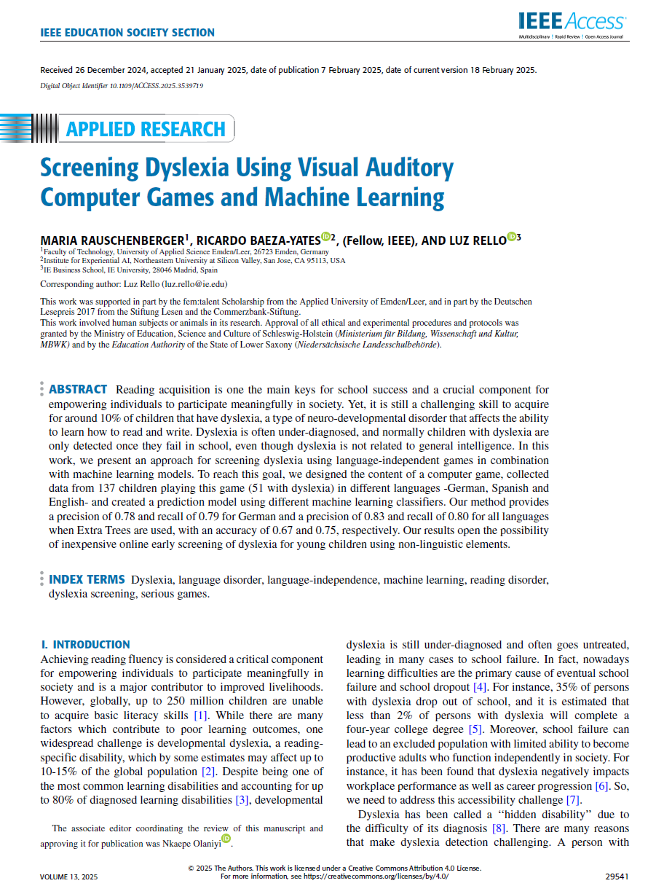

{align=right width="30%"}

*Rauschenberger, Maria; Baeza-Yates, Ricardo; Rello, Luz (2025): **Screening Dyslexia Using Visual Auditory Computer Games and Machine Learning**. IEEE Access, Vol. 13.*, Doi: 10.1109/ACCESS.2025.3539719 **||** [Download](https://doi.org/10.1109/ACCESS.2025.3539719)

### Zusammenfassung  

Eine neue Studie zeigt, dass ein speziell entwickeltes Computerspiel helfen kann, Dyslexie (Lese-Rechtschreib-Störung) frühzeitig zu erkennen. Das Spiel enthält visuelle und auditive Aufgaben, die auf typische Herausforderungen bei Dyslexie abgestimmt sind. 137 Kinder im Alter von 7 bis 12 Jahren spielten es, während ihre Reaktionen erfasst wurden. Mithilfe maschineller Lernverfahren konnten Muster erkannt werden, die auf ein erhöhtes Dyslexie-Risiko hindeuten. Der beste Algorithmus erreichte für deutsche Kinder eine Genauigkeit von 67 % und für alle Sprachen kombiniert 75 %. Da das Spiel keine Sprache erfordert, könnte es eine einfache und kostengünstige Möglichkeit zur Früherkennung bieten.  

<!-- more -->

### Wissenschaftliche Fakten  

- **Untersuchungsziel**: Entwicklung eines sprachunabhängigen Spiels zur Früherkennung von Dyslexie mithilfe maschinellen Lernens.  
- **Teilnehmer**: 137 Kinder (51 mit Dyslexie, 86 Kontrollgruppe).  
- **Altersgruppe**: 7 bis 12 Jahre.  
- **Sprachen**: Deutsch (n = 120), Spanisch (n = 15), Englisch (n = 2).  
- **Spielinhalt**: 16 Stufen mit visuellen und auditiven Aufgaben (jeweils 2 Runden pro Stufe).  
- **Messverfahren**: Visuelle Aufgaben basieren auf Muster- und Symmetrieerkennung, auditive Aufgaben beinhalten das Wiedererkennen von Klängen.  
- **Datenanalyse**: 429 Merkmale pro Teilnehmer (58.773 Datenpunkte insgesamt).  
- **Maschinelle Lernverfahren**: Extra Trees (ETC), Random Forest (RF), Gradient Boosting (GB).  
- **Beste Ergebnisse**
    - **Deutsch (DE):** Genauigkeit 67 %, F1-Score 0,74 (ETC-Modell, auditive Merkmale).  
    - **Alle Sprachen kombiniert (ALL):** Genauigkeit 75 %, F1-Score 0,77 (ETC-Modell, auditive Merkmale).  
- **Ethik & Datenschutz**: Zustimmung der Eltern erforderlich, DSGVO-konforme Datenspeicherung auf deutschem Server, Studienfreigabe durch Bildungsministerien.  

---

### **Ein neues Spiel für eine faire Chance**  

Lina ist 8 Jahre alt und liebt Geschichten. Doch wenn sie versucht, selbst ein Buch zu lesen, verschwimmen die Buchstaben vor ihren Augen. In der Schule merkt sie, dass sie langsamer liest als ihre Klassenkameraden, und manchmal fühlt sie sich deshalb unsicher. Ihre Eltern fragen sich, ob Lina vielleicht an Dyslexie (Lese-Rechtschreib-Störung) leidet – aber eine Diagnose ist kompliziert und dauert oft lange.  

Genau hier setzt eine neue Forschung an: Ein Team von Wissenschaftlern hat ein Computerspiel entwickelt, das Kindern wie Lina helfen könnte. Es ist kein gewöhnliches Spiel – es enthält visuelle und auditive Aufgaben, die auf bekannte Schwierigkeiten bei Dyslexie (Lese-Rechtschreib-Störung) abgestimmt sind. Während Kinder das Spiel spielen, werden ihre Reaktionen erfasst und mithilfe künstlicher Intelligenz ausgewertet.  

Lina testet das Spiel. Sie klickt schnell auf Bilder, merkt sich Töne und löst kleine Rätsel. Alles fühlt sich an wie ein lustiges Experiment, doch im Hintergrund analysieren smarte Algorithmen ihre Leistung. Das Besondere: Weil das Spiel keine Sprache verwendet, funktioniert es für Kinder aus verschiedenen Ländern.  

Am Ende der Studie zeigt sich, dass die Methode vielversprechend ist. Der beste Algorithmus erkennt Dyslexie (Lese-Rechtschreib-Störung) mit einer Genauigkeit von bis zu 75 %. Das bedeutet nicht, dass das Spiel eine ärztliche Diagnose ersetzt – aber es könnte ein erster Hinweis sein, um Kinder frühzeitig zu unterstützen.  

Für Lina könnte das bedeuten, dass sie schneller Hilfe bekommt und nicht mehr das Gefühl hat, hinterherzuhinken. Und vielleicht entdeckt sie bald, dass sie nicht nur Geschichten liebt – sondern auch das Lesen selbst.  

---

🎯 **Fazit**  

Die Studie zeigt, dass ein sprachunabhängiges Spiel eine effektive Möglichkeit zur Früherkennung von Dyslexie sein kann. Mit einer Genauigkeit von bis zu 75 % bei der Analyse durch maschinelles Lernen bietet es eine kostengünstige und leicht zugängliche Ergänzung zu herkömmlichen Tests. Da das Spiel keine sprachlichen Inhalte nutzt, könnte es in vielen Ländern eingesetzt werden – und betroffenen Kindern frühzeitig helfen.  

---

???+ tip "Autor:innen aus dem "Forschen-im-Norden.de"-Team"

    --8<-- "maria_rauschenberger.md"

