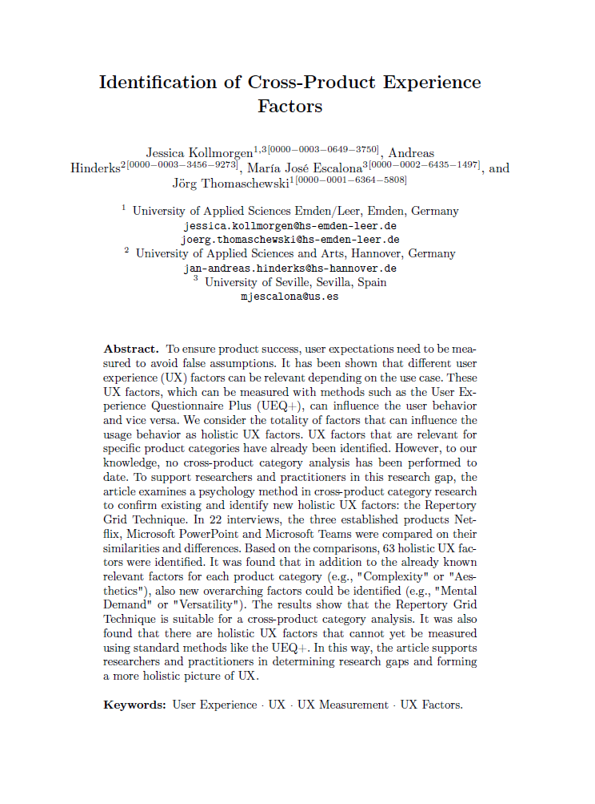

{align=right width="30%"}

*Kollmorgen, Jessica; Hinderks, Andreas; Escalona, María José; Thomaschewski, Jörg (2024): **Identification of Cross-Product Experience Factors**. In: HCII 2024 Conference Proceedings.*  

### Zusammenfassung

Die Studie untersucht, wie **User Experience Faktoren über verschiedene Produktkategorien hinweg analysiert und verglichen werden können**. Während bereits viele UX-Faktoren für spezifische Produktarten identifiziert wurden, fehlt bisher eine **cross-product category analysis** – eine Betrachtung, welche UX-Faktoren unabhängig von der Produktart eine Rolle spielen.  

Zur Untersuchung dieser Fragestellung wurde die **Repertory Grid Technique (RGT)** eingesetzt, eine psychologische Methode zur systematischen Erfassung von Nutzerwahrnehmungen. In **22 Interviews** wurden drei etablierte Produkte – **Netflix, Microsoft PowerPoint und Microsoft Teams** – miteinander verglichen. Die Teilnehmenden identifizierten Unterschiede und Gemeinsamkeiten, wodurch **63 UX-Faktoren** ermittelt wurden.  

<!-- more -->

### Wissenschaftliche Fakten

- **22 Interviews** mit Nutzenden von **Netflix, PowerPoint und Teams**.  
- **378 Konstrukte identifiziert**, aus denen **63 UX-Faktoren** abgeleitet wurden.  
- **Kombination aus qualitativer und quantitativer Analyse**:  
    - In **Teil 1** der Interviews wurden die Nutzenden zu ihrem allgemeinen Nutzungserlebnis befragt.  
    - In **Teil 2** wurden sie gebeten, die drei Produkte miteinander zu vergleichen und dabei Ähnlichkeiten und Unterschiede zu benennen.  
    - In **Teil 3** bewerteten die Teilnehmenden die Produkte anhand der ermittelten Konstrukte auf einer Skala von -3 bis +3.  
- **Bekannte UX-Faktoren bestätigt**, darunter „Intuitive Nutzung“ (Netflix), „Vertrauen“ (Teams) und „Ästhetik“ (PowerPoint).  
- **Neue UX-Faktoren entdeckt, die bisher nicht mit bestehenden Methoden wie dem UEQ+ messbar waren**, z.B.:  
    - **Mentale Beanspruchung** – Wie stark fordert die Nutzung kognitive Ressourcen?  
    - **Vielseitigkeit** – Kann das Produkt in verschiedenen Kontexten effektiv eingesetzt werden?  
    - **Persönliche Initiative** – Wie sehr ermutigt das Produkt zur aktiven Interaktion?  
- **Ergebnisse zeigen**, dass UX-Faktoren nicht nur produkt- oder kontextabhängig sind, sondern auch **über verschiedene Produktkategorien hinweg vergleichbar gemacht werden können**.  

### Die Ergebnisse in tabellarischer Form

Liste einiger UX-Faktoren

| **Kategorie**              | **Bekannte UX-Faktoren (UEQ+ und andere)** | **Neue UX-Faktoren (RGT-Studie)** |
|----------------------------|-------------------------------------------|-----------------------------------|
| **Nutzungserlebnis**       | Intuitive Bedienung, Visuelle Ästhetik, Vertrauen, Nützlichkeit | Mentale Beanspruchung, Vielseitigkeit, Persönliche Initiative, Entspannung |
| **Funktionalität**         | Effizienz, Durchschaubarkeit, Inhaltsqualität | Plattformkompatibilität, Durchsuchbarkeit, Historisierung, Vollständigkeit (Funktionen) |
| **Interaktion & Engagement** | Stimulation, Anpassbarkeit, Attraktivität | Relevanz, Internationalität, Dokumentation, Kategorisierung |

### Story: Die unsichtbaren UX-Faktoren – Warum sich manche Produkte intuitiver anfühlen als andere

Jana ist Produktmanagerin. Ihr Team entwickelt eine neue Kollaborationsplattform für Unternehmen. Die Funktionen sind durchdacht, die Tests verliefen erfolgreich – doch nach den ersten Nutzerbewertungen wird klar: **Die Anwendung fühlt sich nicht so intuitiv an wie erhofft.**  

Jana stellt sich die Frage: **Was genau macht ein Produkt intuitiv?**  

Klassische UX-Fragebögen wie der **UEQ+** liefern zwar wertvolle Erkenntnisse, decken aber nicht alle Aspekte des Nutzungserlebnisses ab. Manche Faktoren, die das Gefühl von **Leichtigkeit oder Frustration** beeinflussen, sind schwer messbar.  

Hier setzt die **Repertory Grid Technique (RGT)** an – eine Methode aus der Psychologie, die es ermöglicht, individuelle Wahrnehmungen systematisch zu erfassen.  

### 💡 Wie funktioniert die Methode?

- In Interviews werden Nutzende gebeten, **drei Produkte miteinander zu vergleichen**.  
- Sie beschreiben, **welche Gemeinsamkeiten zwei Produkte teilen und was das dritte unterscheidet**.  
- Daraus entstehen sogenannte **Konstrukte** – Gegensatzpaare wie **„kompliziert – einfach“** oder **„passiv – aktiv“**.  
- Ähnliche Konstrukte werden zu **holistischen UX-Faktoren** zusammengefasst.  

So fand die Studie heraus, dass manche UX-Faktoren **bisher in gängigen Fragebögen fehlen** – zum Beispiel:  

- **Mentale Beanspruchung**: Warum fühlt sich Microsoft Teams oft anstrengender an als Netflix?  
- **Vielseitigkeit**: Warum wirkt PowerPoint flexibel, während Netflix auf eine spezifische Nutzung beschränkt bleibt?  
- **Persönliche Initiative**: Warum fordert Teams aktive Teilnahme, während Netflix passiven Konsum ermöglicht?  

Diese Faktoren helfen zu verstehen, **warum sich bestimmte Produkte natürlicher oder angenehmer anfühlen als andere** – unabhängig von ihrer Funktion oder Branche.  

### 🎯 Fazit
Eine holistische Betrachtung der UX kann **versteckte Optimierungspotenziale aufdecken** und digitale Produkte gezielter verbessern. Wer UX wirklich verstehen will, muss über klassische Methoden hinausdenken.

---

???+ tip "Autor:innen aus dem "Forschen-im-Norden.de"-Team"

    --8<-- "jessica_kollmorgen.md"

    --- 
    
    --8<-- "andreas_hinderks.md"

    --- 
    
    --8<-- "joerg_thomaschewski.md"

