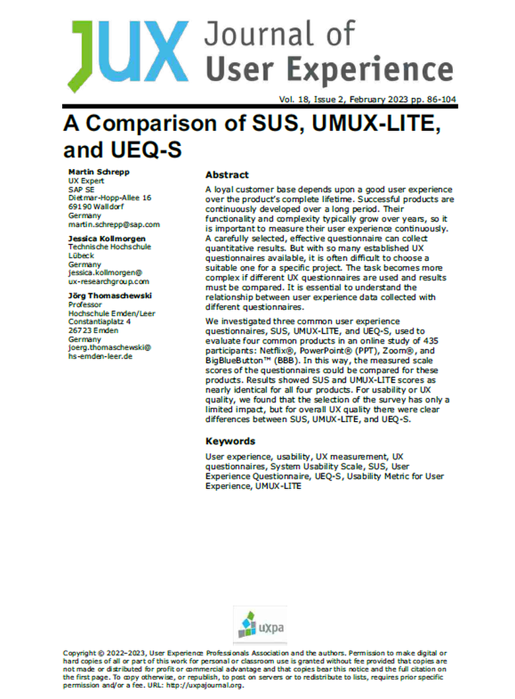

{align=right width="30%"}

*Schrepp, Martin; Kollmorgen, Jessica; Thomaschewski, Jörg (2023): __A Comparison of SUS, UMUX-LITE, and UEQ-S__. In: Journal of User Experience, Vol. 18, Issue 2, February 2023, pp. 86-104* **||** [Download](https://uxpajournal.org/sus-umux-lite-ueq-s/)

### Zusammenfassung

Der Artikel untersucht drei verbreitete Fragebögen zur Messung des Nutzererlebnisses: **SUS (System Usability Scale), UMUX-LITE (Usability Metric for User Experience - Lite)** und **UEQ-S (User Experience Questionnaire - Short Version)**. Ziel ist es, herauszufinden, inwiefern sich die Ergebnisse dieser Methoden unterscheiden oder ähneln. In einer Online-Studie mit 435 Teilnehmern wurden die Fragebögen für vier bekannte Produkte (Netflix, PowerPoint, Zoom und BigBlueButton) angewendet und verglichen. Die Ergebnisse zeigen, dass SUS und UMUX-LITE nahezu identische Bewertungen liefern und sich daher gegenseitig ersetzen können, während der UEQ-S weitere Ergebnisse liefert, da er zusätzlich zur Usability auch die hedonische Qualität misst. Die Autoren kommen zu dem Schluss, dass der UEQ-S die Pragmatische Qualität sehr gut vorhersagt und außerdem noch Aussagen über die Hedonische Qualität macht.  

<!-- more -->

### Wissenschaftliche Fakten  

**Studienziel**  

- Vergleich der drei UX-Fragebögen **SUS**, **UMUX-LITE** und **UEQ-S** hinsichtlich ihrer Ergebnisse und Anwendbarkeit.  

**Methodik**  

- Online-Studie mit **435 Teilnehmern**.  
- Bewertung von vier Produkten: **Netflix, PowerPoint (PPT), Zoom und BigBlueButton (BBB)**.  
- Jeder Teilnehmer füllte alle drei UX-Fragebögen aus.  
- Erfassung demografischer Daten (Alter, Geschlecht, Nutzungshäufigkeit, Erfahrung mit dem Produkt).  
- Analyse der Korrelationen zwischen den Fragebögen.  

**Verwendete Fragebögen**

- **SUS (System Usability Scale)**: 10 Items, Skala von 0 bis 100, misst hauptsächlich Usability.  
- **UMUX-LITE (Usability Metric for User Experience - Lite)**: 2 Items, Skala von 0 bis 100, misst Usability und Nützlichkeit.  
- **UEQ-S (User Experience Questionnaire - Short Version)**: 8 Items, Skala von -3 bis +3, misst **Pragmatische Qualität (PQ)** und **Hedonische Qualität (HQ)**.  

**Ergebnisse**  

- **SUS und UMUX-LITE zeigen fast identische Ergebnisse** für alle vier Produkte (hohe Korrelation von 0.6 bis 0.73).  
- **UEQ-S liefert zusätzliche Erkenntnisse**, da er neben der Usability auch die Hedonische Qualität bewertet.  
- **Häufigere Nutzung eines Produkts führt zu höheren UX-Bewertungen** in allen Fragebögen.  
- **Netflix erhielt die besten UX-Werte**, gefolgt von Zoom, dann BBB und zuletzt PowerPoint.  
- **Benchmark-Vergleich**: SUS und UMUX-LITE bewerteten PowerPoint als durchschnittlich, UEQ-S hingegen als schlecht – bedingt durch die niedrige Hedonische Qualität.  
- **Selbsteingeschätztes Wissen über ein Produkt korreliert mit besseren UX-Werten**, besonders für SUS und UMUX-LITE.  
- **Demografische Faktoren wie Alter und Geschlecht hatten keinen signifikanten Einfluss** auf die UX-Bewertungen.  

**Schlussfolgerung**  

- **SUS und UMUX-LITE sind austauschbar**, wenn nur die Usability gemessen werden soll.  
- **UEQ-S sagt die Pragmatische Qualität sehr gut voraus und liefert zusätzlich Erkenntnisse über die Hedonische Qualität.**  

### Storytelling: Die Suche nach dem richtigen UX-Fragebogen  

Die Autoren dieser Studie standen vor einer zentralen Frage: **Liefern verschiedene UX-Fragebögen vergleichbare Ergebnisse?** In der Praxis gibt es viele etablierte Methoden zur Messung des Nutzererlebnisses, doch oft werden für dasselbe Produkt unterschiedliche Fragebögen verwendet. Ist es möglich, die Ergebnisse direkt miteinander zu vergleichen?  

Um diese Frage zu beantworten, führten sie eine umfangreiche Studie mit **435 Teilnehmern** durch. Diese bewerteten vier bekannte digitale Produkte – **Netflix, PowerPoint, Zoom und BigBlueButton** – anhand von **drei UX-Fragebögen**: **SUS, UMUX-LITE und UEQ-S**. Die Forscher analysierten die Zusammenhänge und stellten fest, dass **SUS und UMUX-LITE fast identische Werte lieferten**, während **UEQ-S weitere Erkenntnisse** über die hedonische Qualität der Nutzung bot.  

Besonders bemerkenswert war die Erkenntnis, dass der **UEQ-S eine gute Wahl im Vergleich zu SUS und UMUX-LITE darstellt**. Er kann die **Pragmatische Qualität** eines Produkts genauso zuverlässig erfassen wie die anderen beiden Fragebögen, bietet jedoch zusätzlich wertvolle Einblicke in die **Hedonische Qualität** – also die Freude und das ästhetische Empfinden bei der Nutzung. Damit liefert UEQ-S eine umfassendere Perspektive auf das Nutzererlebnis und kann in vielen Anwendungsfällen eine sinnvolle Alternative sein.  

---

???+ tip "Autor:innen aus dem "Forschen-im-Norden.de"-Team"

    --8<-- "jessica_kollmorgen.md"

    --- 
    
    --8<-- "joerg_thomaschewski.md"

