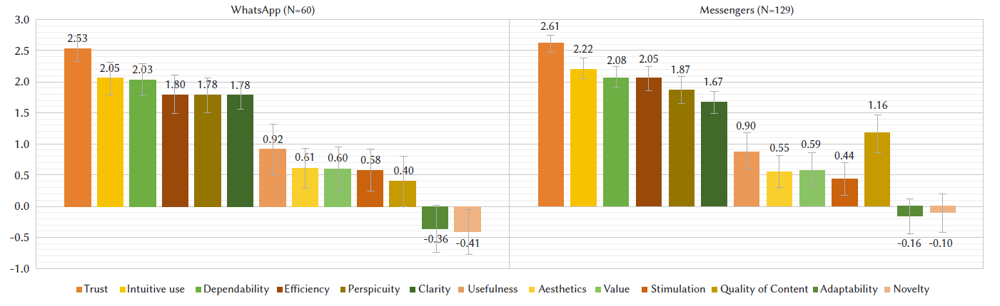

{align=right width="30%"}

*Schrepp, Martin; Kollmorgen, Jessica; Meiners, Anna-Lena; Hinderks, Andreas; Winter, Dominique; Santoso, Harry B.; Thomaschewski, Jörg (2023): __On the Importance of UX Quality Aspects for Different Product Categories__. In: International Journal of Interactive Multimedia and Artificial Intelligence, Vol. 8, No. 2* **||** [Download](https://reunir.unir.net/bitstream/handle/123456789/14368/ijimai8_2_22.pdf)

### Zusammenfassung

Die Autoren untersuchen, welche **Faktoren der User Experience (UX-Faktoren)** für verschiedene Produktarten besonders wichtig sind. In mehreren Studien mit **361 Teilnehmern** wurde untersucht, welche dieser Faktoren je nach Produktkategorie eine größere Rolle spielen. Die Ergebnisse zeigen, dass nicht alle UX-Faktoren für jedes Produkt gleich wichtig sind. **Beispielsweise sind für Videokonferenz-Software Verlässlichkeit, Effizienz und Vertrauenswürdigkeit besonders relevant, während bei Online-Shops Vertrauen, visuelle Ästhetik und die Qualität der Inhalte eine entscheidende Rolle spielen**.  

Die Studie stellt außerdem eine Methode vor, mit der sich die UX **präzise und zuverlässig messen** lässt. Die Autoren fanden heraus, dass **die Bedeutung einzelner UX-Faktoren je Produktkategorie stabil und gut vorhersagbar ist**. Dies ermöglicht eine präzisere Bewertung von UX-Messungen, da Fragebögen gezielt an die jeweilige Produktkategorie angepasst werden können.   

<!-- more -->

### Wissenschaftliche Fakten  

**Studienziel**  

- Untersuchung, welche **UX-Faktoren** je nach **Produktkategorie** besonders wichtig sind.  
- Entwicklung einer **Messmethode**, um die Bedeutung einzelner UX-Faktoren objektiv und reproduzierbar zu erfassen.  

**Methodik**  

- Fünf unabhängige Studien mit insgesamt **361 Teilnehmern**.  
- Untersuchte Produktkategorien:  
  - **Produktivitätssoftware** (z. B. Textverarbeitung, Tabellenkalkulation, Entwicklungsumgebungen)  
  - **Online-Dienste** (z. B. Webshops, Booking-Systeme, Newsportale, Lernplattformen)  
  - **Kommunikations- und Unterhaltungssoftware** (z. B. Messenger, Videokonferenzsysteme, Videoportale, Games)  
- Teilnehmer bewerteten die **Wichtigkeit von UX-Faktoren** je Produktkategorie auf einer **Skala von -3 bis +3**.  
- Datenanalyse mit statistischen Methoden, darunter **Korrelationen, t-Tests und Varianzanalysen**.  

**Wichtigste Faktoren**

- **Produktivitätssoftware:** : Nützlichkeit, Steuerbarkeit, Effizienz, Durchschaubarkeit, Übersichtlichkeit
- **Online-Dienste:** Vertrauen, Inhaltsqualität und Übersichtlichkeit sind entscheidend.  
- **Kommunikation & Unterhaltung:**  
  - **Messenger & Videokonferenzen:** Vertrauen, intuitive Bedienung und Steuerbarkeit
  - **Videoportale & Games:** Immersion, Stimulation, visuelle Ästhetik, Originalität.  
- **Demografische Faktoren (Alter, Geschlecht) und kulturelle Unterschiede haben kaum Einfluss** auf die Bewertungen.  
- **Die ermittelte Wichtigkeit der UX-Faktoren pro Produktkategorie ist stabil und lässt sich zuverlässig vorhersagen.**  

**Schlussfolgerung**  
- Die Studie zeigt, dass **UX-Faktoren je nach Produktart gezielt gewichtet werden müssen**.  
- Die entwickelte **Messmethode ist robust, zuverlässig und für verschiedene UX-Fragebögen anwendbar**.  
- UX-Bewertungen können durch eine **produktkategoriespezifische Anpassung von Fragebögen** deutlich verbessert werden.  

- **Fig. 4**: Bedeutung von UX-Faktoren für WhatsApp im Vergleich zur Produktkategorie „Messenger“.  
    

### Wie wichtig sind UX-Faktoren wirklich?  

Stell dir vor, ein UX-Team arbeitet an der Neugestaltung eines **Online-Shops**. Das Team weiß, dass eine gute UX entscheidend für den Erfolg ist – doch welche UX-Faktoren sind für ihre Kunden wirklich am wichtigsten? Ist es die **visuelle Ästhetik**, das **Vertrauen** in den Shop, oder sind es eher **klare Strukturen und eine verständliche Navigation**?  

Gleichzeitig sitzt ein anderes Team in einem großen Software-Unternehmen und überlegt, wie sie ihre **Videokonferenz-Plattform** verbessern können. Hier geht es weniger um Ästhetik – **Steuerbarkeit, Effizienz und intuitive Bedienung** sind die entscheidenden Faktoren. Doch wie lässt sich das objektiv messen?  

Die Autoren dieser Studie haben genau diese Fragen untersucht. Durch umfassende Analysen mit über **360 Teilnehmern** konnten sie zeigen, dass UX-Faktoren je nach Produktart eine völlig unterschiedliche Rolle spielen. Während bei **Business-Software Effizienz und Steuerbarkeit** dominieren, sind für **Unterhaltungsangebote Faktoren wie Stimulation und Immersion** wichtiger.  

Besonders wertvoll ist die Erkenntnis, dass die Bedeutung einzelner UX-Faktoren **stabil und gut vorhersagbar ist**. Das bedeutet, dass UX-Experten nicht mehr raten müssen, worauf sie sich konzentrieren sollten – sie können ihre Fragebögen und Messmethoden gezielt anpassen, um genau die richtigen UX-Aspekte zu erfassen.  

---

???+ tip "Autoren aus dem "Forschen-im-Norden.de"-Team"

    --8<-- "jessica_kollmorgen.md"

    --- 

    --8<-- "anna-lena_meiners.md"

    ---
    
    --8<-- "andreas_hinderks.md"

    --- 
    
    --8<-- "dominique_winter.md"

    ---
    
    --8<-- "joerg_thomaschewski.md"

