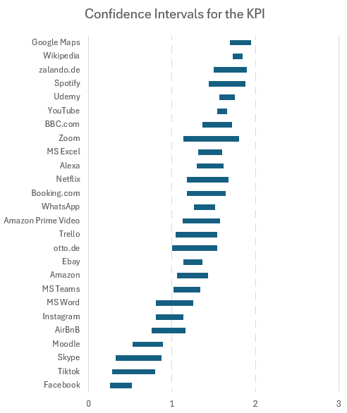

{align=right width="30%"}

*Meiners, Anna-Lena; Schrepp, Martin; Hinderks, Andreas; Thomaschewski, Jörg (2024): __A Benchmark for the UEQ+ Framework: Construction of a Simple Tool to Quickly Interpret UEQ+ KPIs__. In: IJIMAI (International Journal of Interactive Multimedia and Artificial Intelligence) 9 (1), S. 104–111. DOI: 10.9781/ijimai.2023.05.003.* **||** [Download](https://www.ijimai.org/journal/sites/default/files/2024-11/ijimai_9_1_10.pdf)

### Zusammenfassung

Der Artikel beschreibt die Entwicklung eines Benchmarks für das **UEQ+ Framework**, das eine modulare Methode zur Messung des Nutzererlebnisses (UX) bietet. Da bisher kein Benchmark für das UEQ+ existierte, war es schwierig, einzelne UX-Werte sinnvoll zu interpretieren. Die Autoren erstellten daher einen Benchmark-Datensatz aus **3.290 UX-Bewertungen für 26 erfolgreiche Softwareprodukte**. Diese Daten ermöglichen es Forschern und Praktikern, die UX eines Produkts mit etablierten Referenzwerten zu vergleichen. Der Benchmark basiert auf dem **UEQ+ KPI**, einem gewichteten Gesamtwert, der verschiedene UX-Skalen kombiniert. Erste Analysen zeigen, dass ein UX-KPI zwischen **+1 und +2 eine gute UX** repräsentiert. Der Benchmark erlaubt eine schnelle Einordnung von UX-Ergebnissen und kann Unternehmen helfen, fundierte Entscheidungen zur Verbesserung ihrer Produkte zu treffen.

<!-- more -->

### Wissenschaftliche Fakten  

**Studienziel**  

- Entwicklung eines Benchmarks für das UEQ+ Framework, um UX-Ergebnisse besser interpretieren zu können.  

**Methodik**  

- **3.290 UX-Datensätze**, Kombination bereits existierender Studien mit neu erhobenen Daten
- Sprachversionen der Fragebögen: **Deutsch (2.700), Englisch (590)**  
- **26 untersuchte Softwareprodukte**, z. B.: Amazon, YouTube, Google Maps, Wikipedia, Netflix, Spotify, WhatsApp, eBay, Facebook, TikTok  
- **Untersuchte UX-Faktoren (je nach Produkt unterschiedlich)** z.B.: Effizienz, Nützlichkeit, Vertrauen, Visuelle Ästhetik, Stimulation, Qualität der Inhalte, Intuitive Nutzung
- Verwendung des **UEQ+ KPI**, einer gewichteten UX-Kennzahl  

**Ergebnisse**

- Der **UEQ+ KPI reicht von -3 (schlechteste UX) bis +3 (beste UX)**  
- Ein Wert zwischen **+1 und +2 signalisiert eine gute UX**  
- **Google Maps** hatte den höchsten UX-KPI (**1,82**), **Facebook** den niedrigsten (**0,39**)  
- Ein direkter Vergleich zwischen verschiedenen Produktkategorien ist schwierig  

**Schlussfolgerung**  

- Der neue UEQ+ Benchmark hilft Forschern und Unternehmen, UX-Ergebnisse einzuordnen  
- Erste Interpretationsregeln: Werte unter 1 sind verbesserungsbedürftig, Werte über 1 sind gut  
- Weitere Studien sind nötig, um Vergleiche zwischen Produktkategorien besser zu verstehen  

**Abbildung:** KPI-Werte und Konfidenzintervalle der UEQ+ KPIs der untersuchten Produkte  

### Das UX-Dilemma eines Startups  

Lisa ist UX-Researcherin in einem jungen Software-Startup. Ihr Team hat gerade eine neue Projektmanagement-App entwickelt, die mit etablierten Tools wie Trello und Microsoft Teams konkurrieren soll. Nach monatelanger Entwicklung ist die App endlich bereit für die erste große Nutzerstudie. Doch als Lisa die Ergebnisse auswertet, steht sie vor einem Problem: **Ihr UX-Score liegt bei 1,1 – ist das nun gut oder schlecht?**  

Lisa weiß, dass UX-Fragebögen wie der **UEQ+** eine strukturierte Messung ermöglichen. Doch ohne Vergleichswerte ist es schwer zu sagen, ob ihr Produkt wirklich mit der Konkurrenz mithalten kann. Dann entdeckt sie den neuen **UEQ+ Benchmark**, der die UX-Werte von **26 etablierten Softwareprodukten** enthält. Ein Blick auf die Tabelle zeigt ihr:  

- **Trello** hat einen UX-KPI von **1,29**  
- **Microsoft Teams** liegt bei **1,18**  
- **Google Maps**, als Top-Produkt, erreicht **1,82**  
- **Facebook** hingegen hat nur **0,39**  

Mit dieser Einordnung atmet Lisa auf: **Ihr Wert von 1,1 liegt im akzeptablen Bereich**, aber es gibt noch Luft nach oben. Besonders im Bereich „Intuitive Nutzung“ schneidet ihre App schwächer ab als Trello. Lisa kann nun gezielt an Verbesserungen arbeiten – dank des neuen Benchmarks hat sie endlich eine klare Orientierung.  

