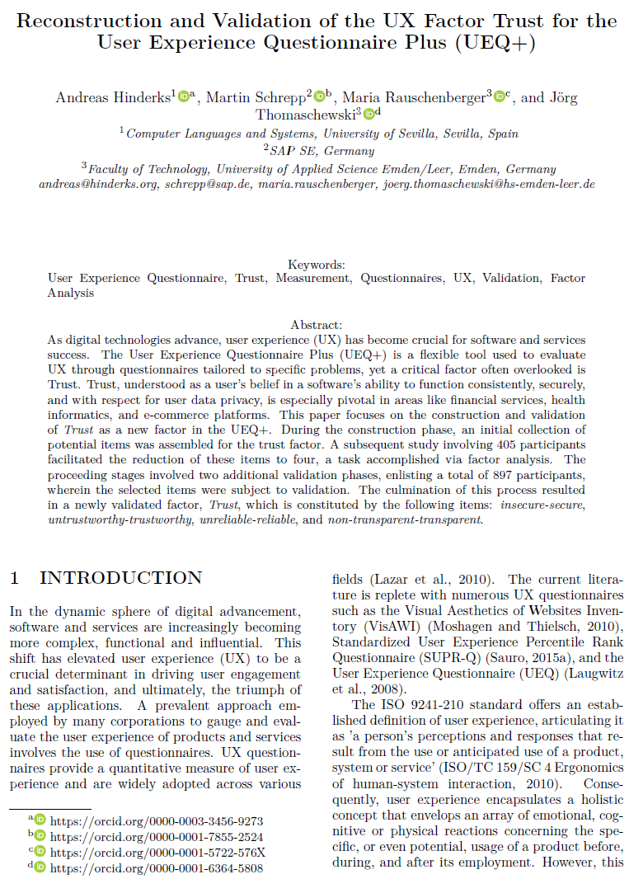

{align=right width="27%"}

*Hinderks, Andreas; Schrepp, Martin; Rauschenberger, Maria; Thomaschewski, Jörg (2023): __Reconstruction and Validation of the UX Factor Trust for the User Experience Questionnaire Plus (UEQ+)__. In: Proceedings of the 19th International Conference on Web Information Systems and Technologies (WEBIST 2023)* **||** [Download](https://www.scitepress.org/Papers/2023/121867/121867.pdf)

### Zusammenfassung

Die Studie untersucht die Konstruktion und Validierung des UX-Faktors **„Trust (Vertrauen)“** für den modularen Fragebogen **UEQ+**. Vertrauen ist eine zentrale Dimension der **User Experience**, insbesondere in sicherheitskritischen Bereichen wie **Finanzdienstleistungen** und **E-Commerce**. Die Autoren entwickelten zunächst eine Sammlung potenzieller Items für diesen Faktor und reduzierten sie durch eine faktorenanalytische Studie mit **405 Teilnehmern** auf vier Hauptitems: **„insecure-secure (unsicher-sicher)“**, **„untrustworthy-trustworthy (unzuverlässig-zuverlässig)“**, **„unreliable-reliable (unseriös-seriös)“** und **„non-transparent-transparent (intransparent-transparent)“**. In zwei weiteren Validierungsstudien mit insgesamt **897 Teilnehmern** wurde die Eignung dieser Items bestätigt. Die Ergebnisse zeigen, dass diese vier Items den Faktor **Vertrauen** zuverlässig messen und unabhängig von anderen UX-Faktoren sind. Damit bietet der **UEQ+** nun eine validierte Möglichkeit, Vertrauen als UX-Dimension zu erfassen.  

<!-- more -->

### Wissenschaftliche Fakten  

**Studienziel** 

- Konstruktion und Validierung des UX-Faktors **Trust (Vertrauen)** für den **UEQ+**.  

**Methodik** 

- Entwicklung einer initialen **Item-Sammlung** für den Faktor Vertrauen.  
- Reduktion der Items durch **Explorative Faktorenanalyse (EFA)** mit **405 Teilnehmern**.  
- Validierung der finalen **vier Items** durch **zwei weitere Studien** mit insgesamt **897 Teilnehmern**.  
- Anwendung von **Konfirmatorischer Faktorenanalyse (CFA)** zur Überprüfung der Faktorstruktur.  

**Teilnehmer & Datenerhebung**  

- **Erste Studie (Konstruktion)**  
    - **405 Teilnehmer**, Online-Befragung (Prolific Academic).  
    - Bewertete Produkte: **Airbnb, Booking.com, TikTok, Trading Apps**.  

- **Zweite Studie (Erste Validierung)**  
    - **443 Teilnehmer** (248 Facebook, 195 YouTube).  
    - Durchführung: Online-Fragebogen in **Deutschland und England**.  

- **Dritte Studie (Zweite Validierung)**  
    - **454 Teilnehmer**, Befragung in Deutschland.  
    - Bewertete Produkte: **Airbnb, Amazon, TikTok, Skype, Booking.com**.  

**Ergebnisse**  

- Reduktion der Items von einer größeren Auswahl auf die vier finalen Items:  
    - **„insecure-secure (unsicher-sicher)“**  
    - **„untrustworthy-trustworthy (unzuverlässig-zuverlässig)“**  
    - **„unreliable-reliable (unseriös-seriös)“**  
    - **„non-transparent-transparent (intransparent-transparent)“**  
- Explorative Faktorenanalyse zeigte **hohe Faktorladungen** für diese vier Items.  
- Konfirmatorische Faktorenanalyse bestätigte **die Unabhängigkeit des Trust-Faktors** von anderen UX-Faktoren.  
- Die Items sind **robust**, konsistent und für verschiedene digitale Produkte anwendbar.  

**Schlussfolgerung**  

- Der **UEQ+** wurde um eine **validierte Skala für Vertrauen** erweitert.  
- Trust (Vertrauen) kann nun als eigenständiger UX-Faktor zuverlässig gemessen werden.  

### Story: Vertrauen entscheidet – Warum wir einer Finanz-App unsere Daten anvertrauen (oder nicht)  

Es gibt unzählige Apps, mit denen man seine **Haushaltskasse** verwalten kann. Sie versprechen alle das Gleiche: **Einfache Budgetplanung, automatische Kategorisierung der Ausgaben und clevere Spartipps**. Klingt praktisch – doch bevor wir eine solche App nutzen, stellen wir uns unweigerlich eine entscheidende Frage:  

💭 **Was passiert mit meinen Daten?**  

Denn um eine Haushalts-App sinnvoll zu nutzen, müssen wir **sehr persönliche Informationen preisgeben**: Monatseinkommen, Fixkosten, Kreditkartendaten. Doch wenn die App unsicher wirkt, unklare Datenschutzrichtlinien hat oder sich vielleicht sogar widersprüchlich äußert, dann ist die Entscheidung klar: **Wir suchen nach einer Alternative.**  

**Vertrauen ist der Schlüssel.** Selbst die beste Funktionalität kann nicht überzeugen, wenn Nutzer der App misstrauen. Deshalb ist es entscheidend, Vertrauen als **messbaren UX-Faktor** zu betrachten. Genau das wurde mit der Erweiterung des **UEQ+** um den Faktor **Trust (Vertrauen)** möglich.  

In einer Studie mit **897 Teilnehmern** wurden vier **Kernaspekte von Vertrauen** identifiziert:  

- **Sicherheit („insecure-secure“ / unsicher-sicher)** – Wird meine finanzielle Sicherheit gewährleistet?  
- **Zuverlässigkeit („untrustworthy-trustworthy“ / unzuverlässig-zuverlässig)** – Ist die App stabil und fehlerfrei?  
- **Seriosität („unreliable-reliable“ / unseriös-seriös)** – Ist das Unternehmen hinter der App glaubwürdig?  
- **Transparenz („non-transparent-transparent“ / intransparent-transparent)** – Werden die Datenschutzrichtlinien verständlich kommuniziert?  

Dank dieser validierten Skala können UX-Teams nun **gezielt messen**, ob Nutzer einer Anwendung vertrauen – und wo es möglicherweise **Probleme gibt**. Denn ohne Vertrauen bleibt eine App ungenutzt, egal wie gut ihre Funktionen sind.  

💡 **Fazit:** Wer eine Finanz-App entwickelt, muss nicht nur für eine intuitive Nutzung sorgen – sondern auch dafür, dass Nutzer sich **sicher fühlen**. Denn UX ist mehr als Design und Usability. **Ohne Vertrauen funktioniert kein digitales Produkt.**  

---

???+ tip "Autor:innen aus dem "Forschen-im-Norden.de"-Team"

    
    --8<-- "andreas_hinderks.md"

    --- 
    
    --8<-- "maria_rauschenberger.md"

    ---
    
    --8<-- "joerg_thomaschewski.md"

