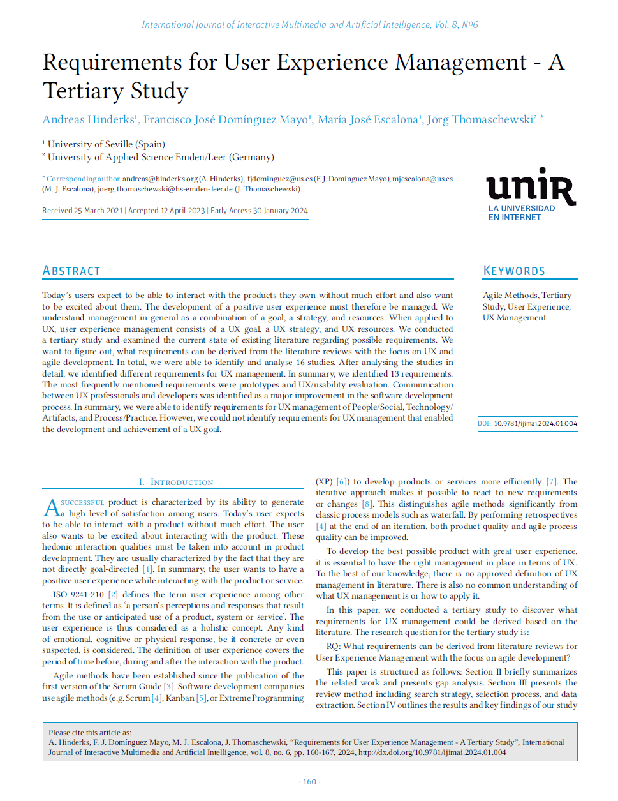

{align=right width="30%"}

*Hinderks, Andreas; Domínguez Mayo, Francisco José; Escalona, María José; Thomaschewski, Jörg (2024): __Requirements for User Experience Management - A Tertiary Study__. In: IJIMAI (International Journal of Interactive Multimedia and Artificial Intelligence) 8 (6), S. 160–167. DOI: 10.9781/ijimai.2024.01.004.* **||** [Download](https://reunir.unir.net/bitstream/handle/123456789/16005/Requirements%20for%20User%20Experience%20Management.pdf)

### Zusammenfassung

Die Studie untersucht die Anforderungen an **User Experience Management (UX-Management)**. Dazu wurde eine **tertiäre Studie** durchgeführt, in der **16 systematische Literaturreviews (SLRs)** analysiert wurden. Ziel war es, herauszufinden, welche Anforderungen für UX-Management in der agilen Entwicklung abgeleitet werden können.  

Als typische Anforderungen wurden **Prototyping** und **UX-/Usability-Evaluation** identifiziert. Besonders betont wird die Notwendigkeit einer **besseren Kommunikation zwischen UX-Professionals und Entwicklern**.  Aber der Schlüssel zum Erfolg ist eine **klare, messbare UX-Strategie**.

<!-- more -->

### Wissenschaftliche Fakten

- 16 systematische Literaturreviews analysiert  
- 13 spezifische Anforderungen identifiziert
- **Hauptanforderungen:**  
    - **People/Social:** Bessere Zusammenarbeit zwischen UX-Teams & Entwicklern  
    - **Technology/Artifacts:** Prototyping & UX-Evaluation  
    - **Process/Practice:** Klare, messbare UX-Strategie notwendig  
- Man braucht: eine **UX Ziel**, eine** UX Strategie** und **UX Resourcen** mit entsprechenden **Verantwortlichkeiten**

{width="80%"}

### UX-Management ohne klare Ziele führt zu einem strukturellen Problem

Anna ist UX-Managerin in einem Softwareunternehmen. Ihr Team hat monatelang an der Neugestaltung einer Finanz-App gearbeitet. Es gab **umfangreiche Tests**, mehrere **Prototyping-Runden** und zahlreiche **interne Feedback-Schleifen**. Als das Projekt kurz vor dem Release steht, wird Anna von der Geschäftsführung gefragt:  

*"Hat sich die User Experience wirklich verbessert?"*  

Sie hält kurz inne. Die App fühlt sich besser an, sie ist intuitiver, die Nutzenden verstehen die Abläufe schneller – aber **wo sind die messbaren Belege?** Welche konkreten Verbesserungen lassen sich nachweisen? **Gab es ein klares UX-Ziel?**  

Ohne eine definierte UX-Strategie bleibt die Bewertung von Verbesserungen oft **subjektiv**. Viele Unternehmen setzen auf **agile Methoden**, aber ohne eine strategische Verankerung von UX bleibt sie ein reaktiver Prozess – getrieben von Einzelfeedbacks statt von klaren, messbaren Zielen. Zudem erschweren knappe Ressourcen und eine **unzureichende Abstimmung zwischen UX-Teams und Entwicklungsteams** eine systematische Umsetzung.  

**Fazit:** UX-Management kann nur erfolgreich sein, wenn es **klare Ziele** gibt, die kontinuierlich gemessen und mit den Entwicklungsteams abgestimmt werden. Eine enge Integration in agile Prozesse sorgt dafür, dass UX nicht nur als letztes Feintuning betrachtet wird, sondern als **zentrale Säule der Produktentwicklung**.  

---

???+ tip "Autor:innen aus dem "Forschen-im-Norden.de"-Team"
   
    --8<-- "andreas_hinderks.md"

    --- 
    
    --8<-- "joerg_thomaschewski.md"

