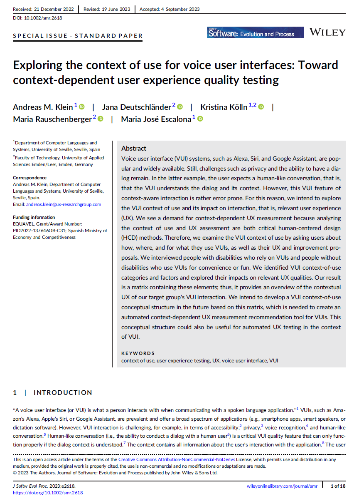
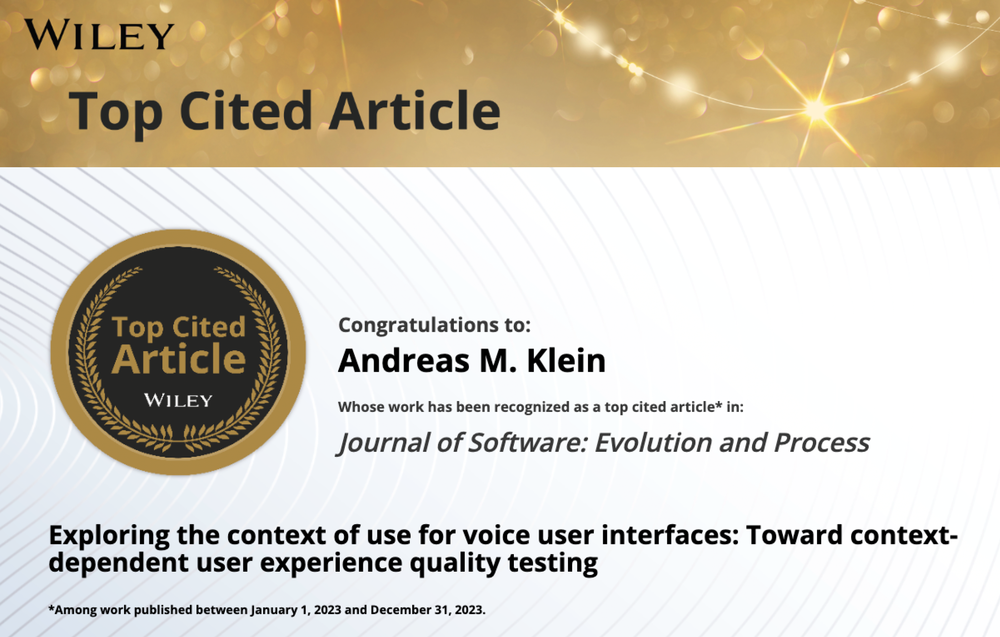
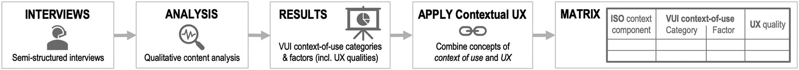
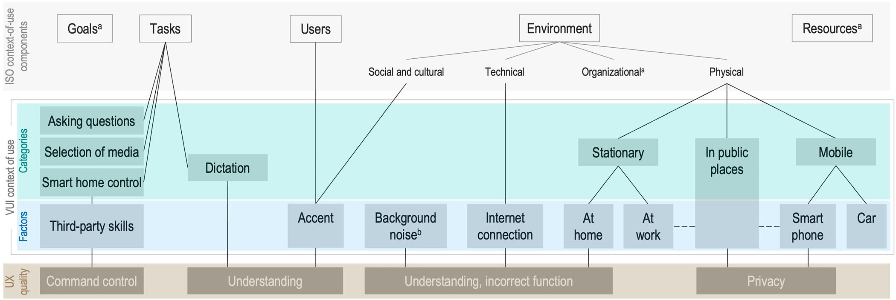
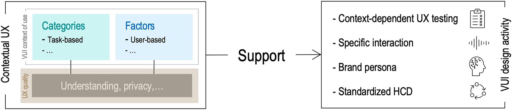

{align=right width="30%"}

*Klein, Andreas M.; Deutschländer, Jana; Kölln, Kristina; Rauschenberger, Maria; Escalona, Maria-Jose (2024): __Exploring the context of use for voice user interfaces: Toward context-dependent user experience quality testing__. In: Journal of Software: Evolution and Process, Wiley.*  Doi: [10.1002/smr.2618](https://doi.org/10.1002/smr.2618) **||** [Download](https://doi.org/10.1002/smr.2618)

{width="50%"}

### Zusammenfassung  

Sprachassistenten wie Alexa, Siri oder Google Assistant sind omipräsent – sei es zur Steuerung von Smart-Home-Geräten, für schnelle Antworten auf Fragen oder als Unterstützung für Menschen mit Einschränkungen. Doch wie gut passen diese Systeme wirklich in den Nutzungskontext der Anwender? Und wie beeinflusst dieser Kontext die Qualität des Nutzererlebnisses?  

Dieser Frage widmet sich die Studie, indem sie untersucht, wie, wo und warum Menschen Sprachassistenten nutzen – mit besonderem Fokus auf den Einfluss des Nutzungskontexts. Zehn ausführliche Interviews mit Nutzern, darunter sechs Personen mit Seh- oder motorischen Beeinträchtigungen, zeigen, dass VUIs zwar enormes Potenzial für Barrierefreiheit haben, aber auch klare Schwächen aufweisen. Besonders problematisch ist das Verständnis von Sprache – vor allem bei Akzenten oder Hintergrundgeräuschen. Auch der Datenschutz bereitet Sorgen. **Was passiert mit unseren Sprachdaten? Wer hört eigentlich mit?**  

Doch es gibt Hoffnung! Die Studie hat eine **Hierarchische Struktur entwickelt**, die zeigt, wie Nutzungskontext und Nutzererlebnis zusammenhängen. Diese könnte die Grundlage für ein intelligentes Bewertungssystem sein, das hilft, Sprachassistenten **besser, bedienbarer und inklusiver** zu machen.  

<!-- more -->

### Wissenschaftliche Fakten  

- **Studienziel:** Analyse des Nutzungskontexts von Sprachassistenten und dessen Einfluss auf UX-Qualität  
- **Methode:** Qualitative Interviews mit **10 Teilnehmern**  
    - **6 Personen mit Seh- oder motorischen Beeinträchtigungen**  
    - **4 Personen ohne Beeinträchtigungen**  
- **Untersuchungszeitraum:** April – Mai 2021, Deutschland  
- **Häufigste Nutzungsszenarien**  
    - Fragen stellen (z. B. Wetter, Nachrichten)  
    - Medienauswahl (Musik, Radio, Podcasts)  
    - Diktieren (Texteingabe, E-Mails, Transkription)  
    - Smart-Home-Steuerung  
- **Hauptprobleme identifiziert**  
    - Mangelndes Sprachverständnis  
    - Eingeschränkte Dialogführung  
    - Datenschutzbedenken  

---

Abbildungen aus dem wissenschaftlichen Artikel  

**Abb. 1: Methodologische Schritte**  

{width="100%"}
  

**Abb. 3: ISO-Komponenten, Nutzungskontext und UX-Faktoren**  

{width="90%"}

Diese Matrix ordnet Nutzungskontexte spezifischen UX-Faktoren zu, um eine **automatisierte, kontextabhängige UX-Messung** zu ermöglichen.  
  

**Abb. 4: Wie Kontext-UX das VUI-Design verbessern kann** 

{width="80%"}

Die Matrix könnte Entwicklern helfen, VUIs gezielter zu optimieren. Beispielsweise könnten Sprachassistenten lernen, Akzente besser zu verstehen oder sich an Umgebungsgeräusche anzupassen.  

---

### Eine Welt, die auf unsere Stimme hört 🎙️
Stell dir vor, du bist blind oder hast eine motorische Beeinträchtigung – für viele alltägliche Aufgaben bist du auf technische Hilfsmittel angewiesen. Hier kommen Sprachassistenten wie Alexa, Siri oder Google Assistant ins Spiel. Doch wie gut funktionieren sie wirklich, wenn es darauf ankommt?

Genau das haben Forscherinnen und Forscher in einer aktuellen Studie untersucht. Sie wollten wissen, wie Menschen Sprachassistenten nutzen, welche Herausforderungen es gibt und wie das Nutzererlebnis verbessert werden kann. Dafür haben sie mit zehn Personen gesprochen – darunter Menschen mit und ohne Beeinträchtigungen.

Die Ergebnisse zeigen: Sprachassistenten sind eine große Hilfe, aber sie haben noch viele Schwächen. Besonders problematisch ist das Verständnis von Sprache – vor allem bei Akzenten oder Hintergrundgeräuschen. Auch der Datenschutz bereitet Sorgen. Was passiert mit unseren Sprachdaten? Wer hört eigentlich mit?

Doch es gibt Hoffnung! Die Studie hat eine **Hierarchische Struktur entwickelt**, die zeigt, wie Nutzungskontext und Nutzererlebnis zusammenhängen. Diese könnte die Grundlage für ein intelligentes Bewertungssystem sein, das hilft, Sprachassistenten **besser, bedienbarer und inklusiver** zu machen.  

### 🎯 Fazit  

Diese Studie liefert einen wichtigen Beitrag zur Verbesserung von Sprachassistenten. Die entwickelte hierarchische Struktur und die Matrix bilden die Grundlage für eine **kontextabhängige UX-Messung**, die in Zukunft in automatisierte Bewertungssysteme integriert werden könnte.  

Durch eine präzisere Analyse der Nutzungskontexte könnten VUIs intelligenter, bedienbarer und inklusiver werden – und uns endlich wirklich verstehen.  

---

???+ tip "Autor:innen aus dem "Forschen-im-Norden.de"-Team"

    --8<-- "andreas_klein.md"

    ---  

    --8<-- "jana_deutschländer.md"

    --- 

    --8<-- "kristina_nagel.md"

    ---

    --8<-- "maria_rauschenberger.md"
