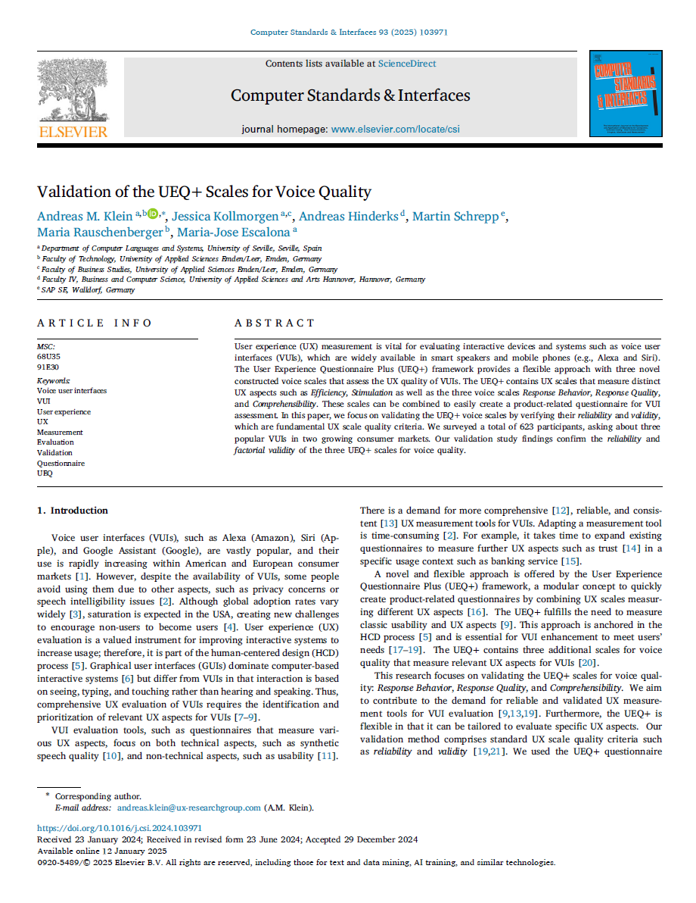
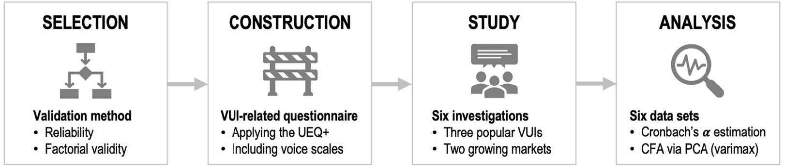
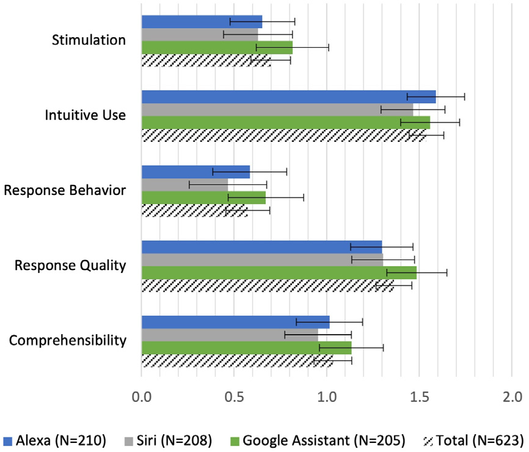
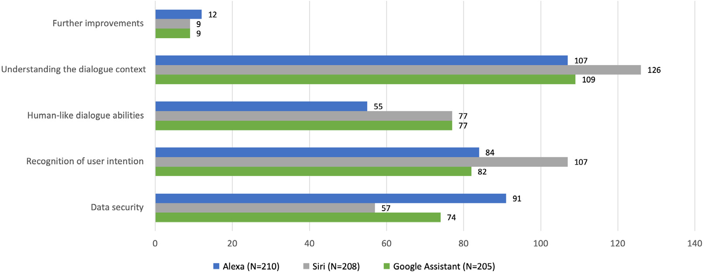

{align=right width="30%"}

*Klein, Andreas M.; Kollmorgen, Jessica; Hinderks, Andreas; Schrepp, Martin; Rauschenberger, Maria; Escalona, Maria-Jose (2025): **Validation of the UEQ+ Scales for Voice Quality**. In: Computer Standards & Interfaces, Vol. 93.*, Doi: 10.1016/j.csi.2024.103971 **||** [Download](https://doi.org/10.1016/j.csi.2024.103971)

### Zusammenfassung  

Sprachassistenten wie Alexa, Siri und Google Assistant sind aus dem Alltag vieler Menschen nicht mehr wegzudenken. Doch wie gut ist ihre User Experience (UX) wirklich? Der Artikel untersucht, wie sich die UX-Qualität von Voice User Interfaces (VUIs) messen lässt. Dafür wurden drei neue Skalen für das **UEQ+ Framework** entwickelt: **„Response Behavior“**, **„Response Quality“** und **„Comprehensibility“**. Diese Skalen erfassen, wie natürlich sich die Sprachassistenten verhalten, wie präzise ihre Antworten sind und wie gut sie gesprochene Befehle verstehen.  

In einer groß angelegten Studie mit **623 Teilnehmer*innen** aus den USA und Großbritannien konnte das Forschungsteam zeigen, dass diese Skalen zuverlässig und valide sind. Besonders spannend: Die Ergebnisse zeigen nicht nur Stärken der Systeme, sondern auch klare Verbesserungsmöglichkeiten – etwa bei der Dialogverständlichkeit oder der Datensicherheit. Damit liefert die Studie eine wertvolle Grundlage für die Weiterentwicklung smarter Sprachassistenten.  

<!-- more -->

### Wissenschaftliche Fakten  

- **Studienziel:** Validierung der neuen UEQ+ Skalen für Voice User Interfaces (VUIs).  
- **Untersuchte Systeme:** Alexa (Amazon), Siri (Apple), Google Assistant (Google).  
- **Stichprobe**  
    - Durchgeführt Februar-März 2023 
    - Gesamtzahl der Teilnehmer:innen: **623** (nach Datenbereinigung).  
    - Herkunft: **USA und Großbritannien**.  
    - Geschlechterverteilung: **306 weiblich, 304 männlich, 9 divers, 4 ohne Angabe**.  
    - Durchschnittsalter: **35,6 Jahre (SD = 12,2 Jahre)**.  
- **Methode:** Bewertung basierte auf 5 UX-Aspekten aus dem **UEQ+ Framework**:  
    - **Stimulation** (Spaß an der Nutzung)  
    - **Intuitive Use** (Intuitive Bedienbarkeit)  
    - **Response Behavior** (Natürlichkeit des Sprachverhaltens)  
    - **Response Quality** (Qualität der Antworten)  
    - **Comprehensibility** (Verständlichkeit der Sprachbefehle)  
- **Wichtige Ergebnisse**  
    - **Hohe interne Konsistenz:** Cronbachs Alpha-Werte für die drei Voice-Skalen zwischen **0,85 und 0,92**.  
    - **Faktorielle Validität bestätigt:** Items der drei Voice-Skalen laden eindeutig auf je einem Faktor.  
    - **Durchschnittliche UX-Bewertung der Sprachassistenten (Skala von -3 bis +3):**  
        - Höchste Werte für **Intuitive Use** (Alexa: 1,59; Siri: 1,47; Google Assistant: 1,56).  
        - Niedrigste Werte für **Response Behavior** (Alexa: 0,59; Siri: 0,47; Google Assistant: 0,67).  
- **Häufigste Verbesserungsvorschläge**  
    - **Bessere Dialogverständlichkeit** (107 Nennungen für Alexa, 126 für Siri, 109 für Google Assistant).  
    - **Genauere Erkennung der Nutzerintention**  
    - **Höhere Datensicherheit**
    - **Natürlichere Sprachführung (menschlichere Konversation)**  

---

Abbildungen aus dem wissenschaftlichen Artikel  

- **Methodische Schritte zur Validierung der UEQ+ Skalen:**  

  {width="80%"}  

- **UX-Bewertung der Sprachassistenten anhand der UEQ+ Skalen:**  

  {width="50%"}  

- **Verbesserungsvorschläge der Teilnehmer*innen:**  

  {width="90%"} 

### „Siri, warum verstehst du mich nicht?“  

Eine einfache Wissensfrage an Siri: „Wie viele Einwohner hat Hamburg?“ wurde wie folgt korrekt beantwortet: „2022 hatte Hamburg 1.892.122 Einwohner.“ Die erste Folgefrage: „Und in Sevilla?“ wurde ebenfalls korrekt beantwortet: „2023 hatte Sevilla 684.025 Einwohner.“ Auf die zweite Folgefrage „Und Madrid?“ antwortete Siri nicht korrekt: „Das habe ich im Internet gefunden.“ Folgen des Dialogkontextes, d.h. erfassen von natürlicher Sprache und typischen Dialogen, z.B. mit Folgefragen, ist für Siri schwierig. 

Diese und weitere Interaktionsbarrieren (z.B. verwenden von Eigennamen oder sprechen mit Akzent) veranlassten die Forschenden zur neuen Studie und der Messung der User Experience von Sprachassistenten. Sie wollten wissen: Wie gut funktionieren Alexa, Siri und Google Assistant wirklich? Und wie lassen sich ihre Stärken und Schwächen erfassen?  

Dafür entwickelten sie drei spezielle Skalen, um die Sprachqualität dieser Systeme zu bewerten: **„Response Behavior“** (= **Antwortverhalten**; wie natürlich sich die Assistenten verhalten), **„Response Quality“** (= **Antwortqualität**; wie präzise ihre Antworten sind) und **„Comprehensibility“** (= **Verständlichkeit**; wie gut sie gesprochene Befehle verstehen). **623 Nutzer*innen** aus den USA und Großbritannien nahmen an der Untersuchung teil – und die Ergebnisse waren aufschlussreich.  

Während die Assistenten in puncto **„Intuitive Use“** gut abschnitten (die meisten Nutzer:innen fanden sie leicht bedienbar), gab es klare Defizite bei der **Verständlichkeit der Dialoge**. Besonders Siri wurde für ihre **schwache Kontext-Erkennung** kritisiert, während Google Assistant bei der Antwortqualität leicht vorne lag. Ein häufig genannter Wunsch: **Natürlichere Gespräche und weniger Missverständnisse**.  

### 🎯 Fazit  

Die Studie zeigt, dass die neuen UEQ+ Skalen eine zuverlässige Methode zur Bewertung der Sprachqualität von Assistenten wie Alexa, Siri und Google Assistant darstellen. Gleichzeitig offenbaren die Ergebnisse klare Verbesserungspotenziale – besonders im Bereich der Sprachverständlichkeit und der natürlichen Dialogführung. Diese Erkenntnisse bieten wertvolle Ansätze für die Weiterentwicklung smarter Sprachassistenten. 

Damit sind nun die folgenden drei UEQ+ Skalen für Sprachanwendungen validiert: **Response Behavior** (= **Antwortverhalten**), **Response Quality** (= **Antwortqualität**) und **Comprehensibility** (= **Verständlichkeit**)

Die Skalen werden bereits in der Forschung und Entwicklung, z.B. zur Evaluation von Pro-aktiven Fahrzeugassistenzsystemen mit LLMs, verwendet.

---

???+ tip "Autor:innen aus dem "Forschen-im-Norden.de"-Team"

    --8<-- "andreas_klein.md"

    ---  

    --8<-- "jessica_kollmorgen.md"

    --- 

    --8<-- "andreas_hinderks.md"

    --- 

    --8<-- "maria_rauschenberger.md"