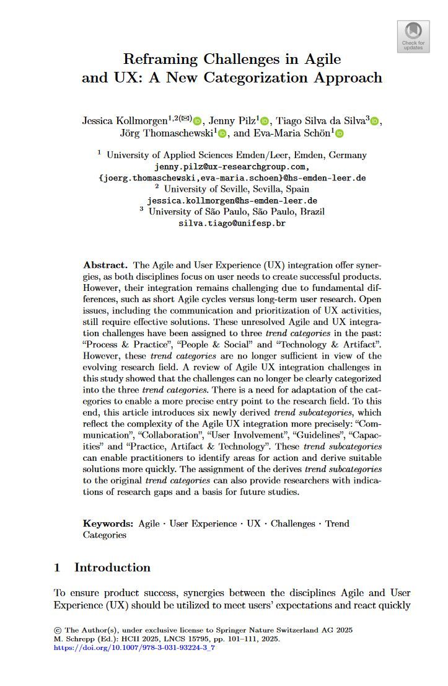
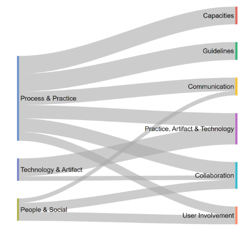

{align=right width="35%"}

*Kollmorgen, J.; Pilz, J.; Silva da Silva, T.; Thomaschewski, J.; Schön, E.M. (2025): __Reframing Challenges in Agile and UX: A New Categorization Approach__. In: Schrepp, M. (eds) *Design, User Experience, and Usability*. HCII 2025. Lecture Notes in Computer Science, vol 15795. Springer, Cham.* Doi: 10.1007/978-3-031-93224-3_7 **||** [Download](https://doi.org/10.1007/978-3-031-93224-3_7)

### Zusammenfassung

Agile Entwicklung und UX verfolgen beide das Ziel, bessere Produkte zu schaffen, treffen in der Praxis häufig aufeinander: UX-Aufgaben passen nicht in Sprint-Rhythmen, Zuständigkeiten bleiben unklar, Nutzerbeteiligung kommt zu kurz. Eine Analyse von 86 wissenschaftlichen Artikeln zeigt, dass die heutigen  Herausforderungen nicht mehr in das klassische Dreierschema „Process & Practice“, „People & Social“ und „Technology & Artifact“ passen. Die Autorinnen und Autoren haben daher die 28 am häufigsten beschriebenen Probleme neu geordnet und sechs präzisere Kategorien gebildet: „Kommunikation“, „Zusammenarbeit“, „Nutzerbeteiligung“, „Leitlinien“, „Kapazitäten“ sowie „Praxis, Artefakt und Technologie“. Mit dieser feineren Struktur lassen sich Reibungspunkte schneller erkennen, passende Lösungen gezielt auswählen.

<!-- more -->

### Wissenschaftliche Fakten

- Ziel: Entwicklung einer feineren Kategorisierung zur Einordnung aktueller Herausforderungen bei der Integration von Agile und Nutzererlebnis (UX)
- Methode: Systematische Literaturübersicht (Literature Review) nach Kitchenham & Charters, Analyse von 86 praxisnahen Artikeln (u.a. Fallstudien)
- Analysierte Herausforderungen: 28 spezifische Herausforderungen aus der Literatur
- Frühere Kategorisierung: Drei Hauptkategorien („Process & Practice“, „People & Social“, „Technology & Artifact“) erwiesen sich als zu grob für die heutige Vielfalt an Problemen
- Zentrale neue Erkenntnis: Viele Herausforderungen lassen sich nicht mehr eindeutig nur einer Kategorie zuordnen
- Neue Systematik: Sechs Subkategorien wurden aus den 28 Herausforderungen abgeleitet
  - Kommunikation
  - Zusammenarbeit
  - Nutzerbeteiligung
  - Leitlinien
  - Kapazitäten
  - Praxis, Artefakt & Technologie
- Validierung: Die Ableitung der Subkategorien erfolgte evidenzbasiert und im Diskussionsprozess durch fünf Forschende zur Steigerung von Objektivität und Replizierbarkeit
- Relevanz: Das neue Kategoriensystem unterstützt Praktiker dabei, gezielter an eigenen Schwächen zu arbeiten, und bietet Forschenden eine strukturiertere Grundlage zur Identifikation von Forschungslücken
- Forschungsfrage: Wie können bestehende Trendkategorien erweitert werden, um Herausforderungen der Integration von Agile und Nutzererlebnis präziser abzubilden?
- Literaturbasis: 86 Artikel, 28 Herausforderungen, Zuordnung sowohl zu alten als auch neuen Kategorien dokumentiert

---

### Ausgewählte Tabellen und Abbildungen

**Tabelle 1: Übersicht der klassischen Trendkategorien**

| Trendkategorie         | Beschreibung                                                                                                                                                                           |
|-----------------------|----------------------------------------------------------------------------------------------------------------------------------------------------------------------------------------|
| Process & Practice    | Integration ist das Zusammenführen und Synchronisieren von UXD- und agilen Prozessen, um einen einheitlichen Prozess mit beiden Perspektiven sowie die Einbindung von UXD-Praktiken zu ermöglichen. |
| People & Social       | Integration bedeutet Veränderung der Teamzusammensetzung zur Zusammenführung von Expert:innen beider Disziplinen sowie soziale Interaktion und gemeinsames Wissensmanagement.           |
| Technology & Artifact | Integration umfasst den Einsatz technischer Mittel zur Unterstützung und Koordination von Aktivitäten sowie die Zusammenführung von Artefakten beider Prozesse zur Förderung des gemeinsamen Verständnisses. |

**Tabelle 3: Beschreibung der sechs neu abgeleiteten Trend-Subkategorien**

| Trend-Subkategorie          | Beschreibung                                                                                           | Beispiele                                                |
|-----------------------------|--------------------------------------------------------------------------------------------------------|----------------------------------------------------------|
| Kommunikation               | Herausforderungen durch Informationslücken und fehlenden kontinuierlichen Austausch aller Beteiligten  | Geografische Teamverteilung, Transparenz, getrennte Teams, Gesamtüberblick bewahren |
| Zusammenarbeit              | Einbindung von Prioritäten und Zielen zwischen Teams unterschiedlicher Disziplinen                    | Rollenverständnis, Verantwortlichkeiten, Mindset, erwartete Beiträge |
| Nutzerbeteiligung           | Einbindung der Nutzer:innen in den Projektzyklus sowie das Verständnis und Erfüllen ihrer Bedürfnisse | Differenzierung von Nutzer:innen & Kund:innen, Nacharbeit & Refactoring   |
| Leitlinien                  | Mangel an passenden Standards und Richtlinien zur Integration von Agile und UX                        | Rahmenwerke/Modelle, fehlende Toolunterstützung, Detaillierungsgrad der Dokumentation, fehlendes UX-Management |
| Kapazitäten                 | Ressourcen, organisatorische Rahmenbedingungen und allgemeine Voraussetzungen                          | Budget, Anzahl Mitarbeitende, Zeiteinschätzung, Verfügbarkeit von Spezialist:innen, Arbeitsbelastung, unpassende Prozesse |
| Praxis, Artefakt & Technologie | Herausforderungen bei der Anwendung konkreter Werte und Methoden aus Agile und UX                   | User Stories, Prototyping, Personas, technische Machbarkeit |

{align=right width="35%"}

**Abbildung 2:** Mapping der drei klassischen Trendkategorien zu den sechs neuen Trend-Subkategorien  
*Die Abbildung zeigt grafisch, dass viele Herausforderungen mehreren Subkategorien zugeordnet werden können und die klassische Trennung in drei Kategorien nicht mehr ausreicht. Die neuen Subkategorien bieten einen differenzierteren Überblick und erleichtern die Identifikation von Forschungslücken sowie gezielte Maßnahmen für Praktiker.*

---

### Motivierende Einordnung: Ein fiktives Interview

*Moderatorin:* Was ist durch die neue Kategorisierung anders?  
*Jessica (Agile Coach):* Viele Herausforderungen bei der Zusammenarbeit von Agile und Nutzererlebnis waren früher schwer zuzuordnen. Mit den neuen Subkategorien wird sichtbar, ob es z.B. um fehlende Kommunikation, Rollenunklarheit oder unzureichende Leitlinien geht. Das erleichtert uns im Alltag, gezielt an Lösungen zu arbeiten und die passenden Methoden auszuwählen.  
*Tim (UX Researcher):* Für mich als Praktiker bedeutet das: Ich finde viel schneller die passende Stellschraube, wenn es klemmt – egal ob beim täglichen Team-Check-in, bei der Nutzerbeteiligung oder der Toolauswahl.  
*Moderatorin:* Und die Forschung?  
*Jessica:* Auch Forschende sehen nun genauer, welche Bereiche bereits gut erforscht sind und wo noch Bedarf für neue Studien besteht.

???+ tip "Autor:innen aus dem "Forschen-im-Norden.de"-Team"

    --8<-- "jessica_kollmorgen.md"

    ---
    
    --8<-- "jenny_pilz.md"

    ---
    
    --8<-- "joerg_thomaschewski.md"

    ---
    
    --8<-- "eva_schoen.md"

