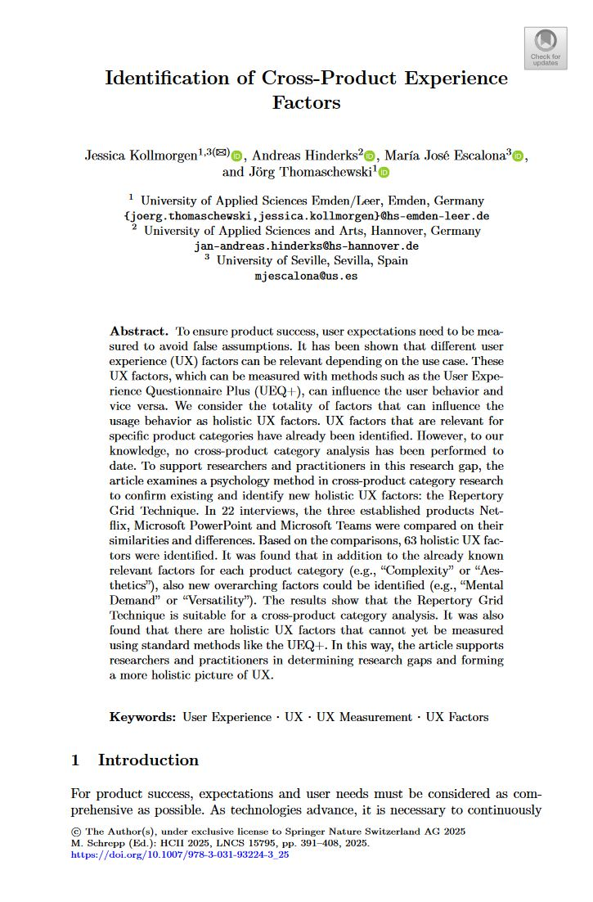
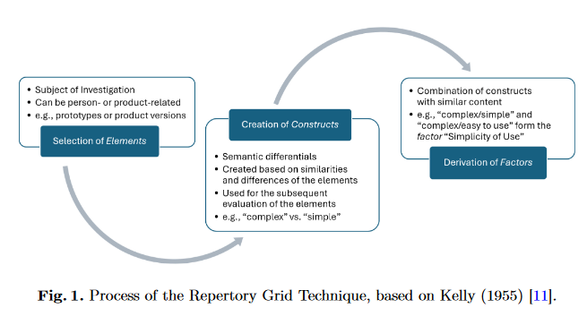

{align=right width="35%"}

*Kollmorgen, J.; Hinderks, A.; Escalona, M.J.; Thomaschewski, J. (2025): __Identification of Cross-Product Experience Factors__. In: Schrepp, M. (eds) Design, User Experience, and Usability. HCII 2025. Lecture Notes in Computer Science, vol 15795. Springer, Cham.* Doi: 10.1007/978-3-031-93224-3_25 **||** [Download](https://doi.org/10.1007/978-3-031-93224-3_25)

### Zusammenfassung

Der Artikel untersucht, wie mit der Repertory Grid Technique (RGT), einer psychologischen Interviewmethode, neue und bereits etablierte UX-Faktoren identifiziert werden können. Hintergrund ist die Beobachtung, dass bestehende UX-Fragebögen wie der UEQ+ nicht alle relevanten Aspekte abbilden. In 22 Interviews wurden die Produkte Microsoft Teams, Microsoft PowerPoint und Netflix gezielt hinsichtlich Gemeinsamkeiten und Unterschieden verglichen. Daraus entstanden 378 semantische Gegensatzpaare (Konstrukte), die in 63 übergeordnete UX-Faktoren überführt wurden. Neben bekannten Faktoren wie Ästhetik oder Verständlichkeit wurden auch neue, bisher nicht messbare, aber häufig genannte UX Faktoren identifiziert. Beispiele sind Mentale Anforderung, Vielseitigkeit und Entspannung. Die Studie zeigt, dass RGT ein wertvolles Instrument zur Erweiterung bestehender UX-Messverfahren sein kann und hilft, ein umfassenderes Verständnis für Nutzererlebnisse in unterschiedlichen Anwendungskontexten zu entwickeln.

<!-- more -->

### Wissenschaftliche Fakten

- Anzahl der Probanden: 22 (10 weiblich, 12 männlich)  
- Alter: 26–63 Jahre (Durchschnitt: 33,68 Jahre)   
- Dauer der Untersuchung: Juli bis Oktober 2024  
- Methode: Repertory Grid Technique (RGT)  
- Verglichene Produkte: Netflix, PowerPoint, Microsoft Teams  
- Vergleichsstruktur: Triadenvergleiche und Skalenbewertung (−3 bis +3)  
- Anzahl generierter Konstrukte: 378; Anzahl gebildeter UX-Faktoren: 63  
- Beispielhafte neue, übergeordnete UX-Faktoren: Mentale Anforderung, Vielseitigkeit, Entspannung, Persönliche Initiative, Plattformkompatibilität, Ort der Nutzung, Nutzungsumgebung  
- Beispielhafte bereits bekannte UX-Faktoren (auch in UEQ+):  Visuelle Ästhetik, Vertrauen, Effizienz  
- Beispielhafte Ratings (Skala −3 bis +3):  
    - Kommunikativität: Netflix −2,29 | PowerPoint −0,60 | Teams +2,43  
    - Unterhaltungswert: Netflix +1,86 | PowerPoint −1,00 | Teams −1,07  
    - Sinn für Gemeinschaft: Teams +1,25 | Netflix −0,63 | PowerPoint −0,69  
- Vergleich mit UEQ+: 17 von 27 Faktoren deckungsgleich  
- Erkenntnis: RGT kann sowohl etablierte als auch neue UX-Faktoren erfassen  
- Limitationen: Nur drei Produkte, nur deutschsprachige Teilnehmende  

### Wichtige Abbildungen

**Figure 1 – Übersicht über das RGT Studiendesign**  
Fünf Schritte: Produktauswahl → Interviews → Konstruktextraktion → UX-Faktorenbildung → Bewertung im Grid  

### Die Geschichte zum Artikel

„Was ist eigentlich ein gutes Nutzererlebnis?“ Diese Frage stellte sich UX-Forscherin Anna eines Tages, als sie ihren Feierabend mit Netflix verbringen wollte – nur um wenige Minuten später eine Besprechung in Microsoft Teams führen zu müssen und danach noch eine PowerPoint-Präsentation zu finalisieren. Drei digitale Produkte, drei völlig unterschiedliche Stimmungen. Entspannung bei Netflix. Produktivität mit PowerPoint. Koordination im Team.

Doch wie lassen sich diese Eindrücke wissenschaftlich erfassen? Gemeinsam mit ihrem Forschungsteam entwickelte Anna eine Studie, um herauszufinden, welche Aspekte des Nutzererlebnisses über Produktkategorien hinweg eine Rolle spielen – und welche vielleicht bisher gar nicht erfasst werden.

Dazu nutzten sie eine psychologische Methode namens *Repertory Grid Technique*. In Interviews baten sie 22 Personen, die drei Produkte miteinander zu vergleichen. Welche Gemeinsamkeiten gibt es? Wo liegen die Unterschiede? Die Teilnehmenden bildeten semantische Gegensatzpaare wie „beruhigend vs. fordernd“ oder „persönlich vs. sachlich“. Am Ende standen 378 solcher Konstrukte – ein Schatz an UX-Wahrnehmungen.

Diese wurden in 63 übergeordnete UX-Faktoren zusammengeführt. Viele davon klangen vertraut: Vertrauen, Ästhetik, Verständlichkeit. Andere waren neu: Mentale Anforderung, Entspannung, Vielseitigkeit. Faktoren, die bisher in standardisierten Fragebögen kaum auftauchen – aber das Nutzererlebnis maßgeblich prägen.

Die Studie zeigte: UX ist mehr als nur Bedienbarkeit und Gestaltung. Es ist ein Zusammenspiel aus Kontext, Emotion und Funktion – und RGT hilft, dieses komplexe Gefüge sichtbar zu machen.

???+ tip "Autor:innen aus dem "Forschen-im-Norden.de"-Team"

    --8<-- "jessica_kollmorgen.md"

    ---
    
    --8<-- "andreas_hinderks.md"

    ---
    
    --8<-- "joerg_thomaschewski.md"

