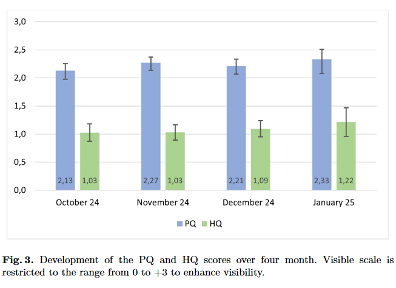

{align=right width="35%"}

*Schaa, M.; Kollmorgen, J.; Thomaschewski, J.; Schrepp, M. (2025): __Combining Questionnaires and Usage Tracking to Monitor the User Experience of an e-Commerce Solution__. In: Schrepp, M. (eds) *Design, User Experience, and Usability*. HCII 2025. Lecture Notes in Computer Science, vol 15795. Springer, Cham.* Doi: 10.1007/978-3-031-93224-3_11 **||** [Download](https://doi.org/10.1007/978-3-031-93224-3_11)

### Zusammenfassung

Die kontinuierliche Messung der UX startete in einem typischen Webshop als praktischer Test: Lässt sich mit überschaubarem Aufwand herausfinden, wie Kund*innen das digitale Einkaufserlebnis wirklich wahrnehmen? Schon nach kurzer Zeit zeigte sich der Nutzen dieses Ansatzes. Durch die Integration des UEQ-S-Fragebogens direkt nach dem Bestellabschluss und die Kombination mit technischen Nutzungsdaten entstand ein umfassendes Bild. 

Die Ergebnisse zeigten schnell, wo die Stärken liegen – etwa bei der einfachen und klaren Bedienung – und an welchen Stellen noch Verbesserungspotenzial besteht. Besonders Desktop-Nutzer bewerten das Einkaufserlebnis konstant positiv, während mobile Nutzer häufiger kleinere Schwächen bemerken. Die Detailanalyse nach Produktkategorien offenbarte, dass gezielte Optimierungen für einzelne Sortimente einen großen Unterschied machen können.

Am Ende bleibt die Erkenntnis: Auch kleine und mittlere Online-Shops können mit pragmatischen, datenbasierten Methoden das Nutzererlebnis ihrer Kund*innen kontinuierlich steigern. Der Mix aus kurzen Fragebögen und Nutzungsanalyse liefert klare Hinweise für konkrete Verbesserungen und hilft dabei, aus einmaligen Käufen dauerhafte Kundentreue zu entwickeln.

<!-- more -->

### Wissenschaftliche Fakten

- Ziel der Studie: Kombination von Nutzererlebnis-Fragebogen (UEQ-S) und Nutzungsdaten zur kontinuierlichen Messung und Optimierung des Nutzererlebnisses eines E-Commerce-Shops.
- Shop: Deutscher Webshop, ca. 13.300 Produkte, ca. 120 Käufe pro Tag, Zielgruppe: ca. 90 % B2B, 10 % B2C.
- Studiendauer: 01.10.2024 bis 15.01.2025.
- Teilnehmer: 14.886 Kund*innen erreichten die Checkout-Seite, 1.439 reichten den UEQ-S ein (Rücklaufquote: 9,7 %), nach Datenbereinigung 1.073 vollständige Datensätze.
- Fragebogen: UEQ-S misst Pragmatic Quality (PQ) und Hedonic Quality (HQ) anhand 8 Items (je 4 pro Skala).
- Erhobene Nutzungsdaten: Gerätetyp, Bildschirmauflösung, Kundenstatus (B2B/B2C), Anzahl vorheriger Bestellungen, Anzahl Produkte im Warenkorb, Zugangskanal, bestellte Produktkategorie.
- Statistische Auswertung: Mittelwerte, Standardabweichungen, Konfidenzintervalle, Varianzanalysen (AoV), Gruppenvergleiche.
- Ergebnisse – Gesamtwerte:  
  - PQ: Mittelwert 2,23 | Std.-Abw. 1,03 | n = 1.073 | 95%-KI [2,17; 2,29]
  - HQ: Mittelwert 1,07 | Std.-Abw. 1,32 | n = 1.073 | 95%-KI [0,99; 1,15]
  - Gesamt-UX: Mittelwert 1,65 | Std.-Abw. 1,04 | n = 1.073 | 95%-KI [1,59; 1,71]
- Einzelitems: „kompliziert/einfach“ (PQ) und „nicht interessant/interessant“ (HQ) signifikant am höchsten bewertet (Welch-Test, p < .05).
- Verlauf über Zeit: Keine signifikanten Schwankungen, leichte HQ-Steigerung nach Template-Update im Dezember.
- B2B vs. B2C: Keine signifikanten Unterschiede in PQ und HQ, beide Gruppen vergleichbar zufrieden.
- Gerätetyp: Desktop (n=768) und Tablet (n=193) zeigen signifikant bessere PQ-Werte als Smartphone (n=109) (AoV, p < 0,0008); HQ unabhängig vom Gerätetyp.
- Nutzungserfahrung: Anzahl vorheriger Bestellungen beeinflusst PQ und HQ nicht signifikant.
- Anzahl Produkte im Warenkorb: Kein signifikanter Einfluss auf PQ und HQ.
- Zugangskanal (Google, Bing, Newsletter, Sonstiges): Kein signifikanter Einfluss auf PQ und HQ.
- Produktkategorie: Kund*innen, die Vakuumbeutel kaufen, sind bei PQ signifikant weniger zufrieden (AoV, p < 0,0279); HQ nicht signifikant betroffen.
- Umsetzung: Fragebogen und Tracking vollständig DSGVO-konform, Auswertung anonymisiert.

---

### Wichtige Abbildungen und Tabellen

**Abbildung 3: Zeitliche Entwicklung der PQ- und HQ-Werte**

*Verlauf der Mittelwerte für Pragmatic Quality (PQ) und Hedonic Quality (HQ) von Oktober 2024 bis Mitte Januar 2025. Werte bleiben stabil und leichte Steigerung der HQ im Januar nach einem keinen Update.*

**Tabelle 2: Einzelwerte der 8 UEQ-S-Items**

| Item (deutsch/englisch)                              | Mittelwert | Std.-Abw. | 95%-Konfidenzintervall |
|------------------------------------------------------|------------|-----------|------------------------|
| behindernd/unterstützend (obstructive/supportive)    | 2,20       | 1,10      | [2,13 ; 2,26]          |
| kompliziert/einfach (complicated/easy)               | 2,34       | 1,11      | [2,27 ; 2,40]          |
| ineffizient/effizient (inefficient/efficient)        | 2,23       | 1,12      | [2,16 ; 2,29]          |
| verwirrend/übersichtlich (confusing/clear)           | 2,17       | 1,19      | [2,10 ; 2,24]          |
| langweilig/spannend (boring/exciting)                | 1,07       | 1,41      | [0,99 ; 1,16]          |
| uninteressant/interessant (not interesting/interesting) | 1,53    | 1,30      | [1,45 ; 1,61]          |
| konventionell/originell (conventional/inventive)     | 0,83       | 1,60      | [0,74 ; 0,93]          |
| herkömmlich/neuartig (usual/leading edge)            | 0,79       | 1,54      | [0,69 ; 0,88]          |

???+ tip "Autor:innen aus dem "Forschen-im-Norden.de"-Team"

    --8<-- "marco_schaa.md"

    ---
    
    --8<-- "jessica_kollmorgen.md"

    ---
    
    --8<-- "joerg_thomaschewski.md"
