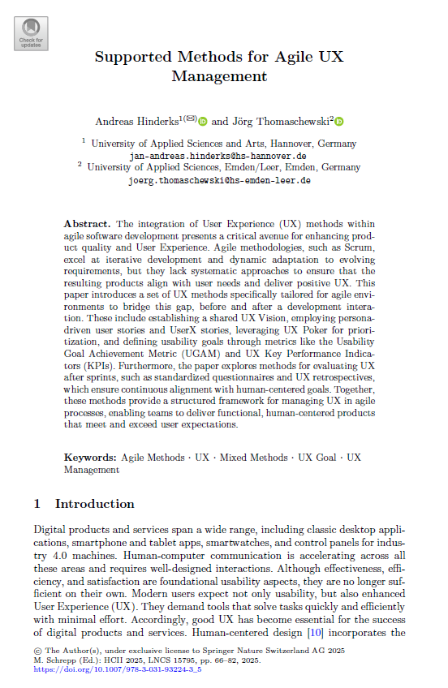
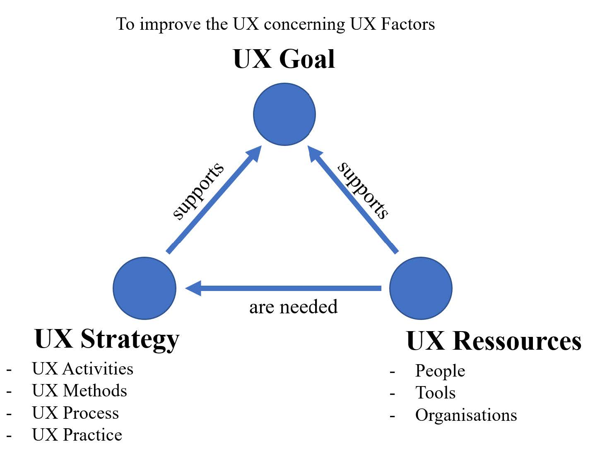
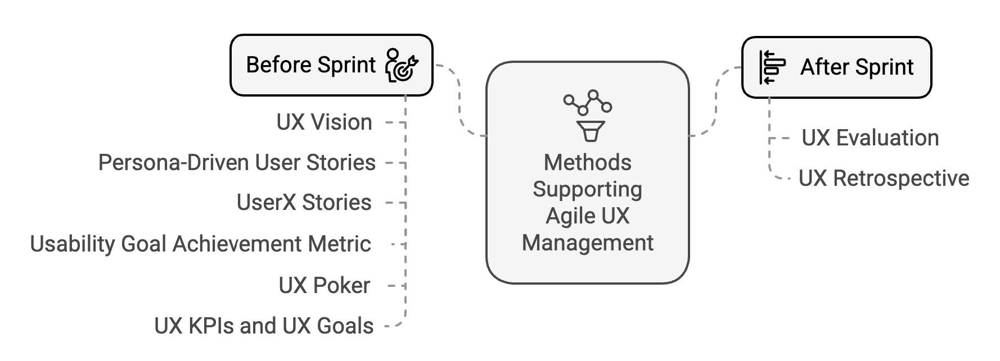

{align=right width="30%"}

*Hinderks, Andreas; Thomaschewski, Jörg (2025):* __Supported Methods for Agile UX Management__. In: Schrepp, M. (eds) *Design, User Experience, and Usability. HCII 2025. Lecture Notes in Computer Science, 15795, pp. 66–82.  Springer, Cham.* Doi: 10.1007/978-3-031-93224-3_5  **||** [Download](https://doi.org/10.1007/978-3-031-93224-3_5)

### Zusammenfassung

Der Artikel beschreibt ein Vorgehen, mit dem agile Teams die User Experience in jedem Sprint systematisch berücksichtigen. Am Anfang entwickeln alle Beteiligten eine gemeinsame Vision, Anforderungen werden über Personas und UserX-Stories erfasst und mittels UX-Poker priorisiert. Klare Usability Goal Achievement Metrics und UX-Kernzahlen sorgen dafür, dass konkrete Ziele definiert sind. Nach einigen Sprints liefern standardisierte Fragebogen-Evaluierungen und eine UX-Retrospektive einen direkten Abgleich zwischen den Zielen und den Ergebnissen. So lässt sich die User Experience Schritt für Schritt optimieren und fest im Entwicklungsablauf verankern.

<!-- more -->

### Wissenschaftliche Fakten

- **Zielsetzung**: Systematischen Integration von User Experience-Methoden in agile Softwareentwicklungsprozesse, um UX-Ziele von der Planung bis zur Retrospektive fest im Sprint-Zyklus zu verankern  
- **Methodischer Ansatz**:  Konzeptueller Framework basierend auf Literatur- und Praxisanalysen  

#### Vor-Sprint-Methoden

- **UX Vision**: Gemeinsame Formulierung einer übergeordneten UX-Vision zur Synchronisation aller Stakeholder  
- **Persona-Driven User Stories**: Integration detaillierter Personas in User Stories inkl. Kontext-Sketches zur präzisen Anforderungsbeschreibung  
- **UserX Story**: Erweiterte User Stories mit UX-Elementen (Personas, Ziele, Interaktionen, Kontexte, Nielsen-Heuristiken)  
- **UX Poker**: Gruppenschätzung des UX-Impacts von User Stories auf einer Skala von –3 bis +3, gefolgt von Diskussion und Priorisierung  
- **UX-Ziele (UGAM)**: Definition messbarer Usability Goal Achievement Metrics zur Bewertung vordefinierter Nutzbarkeitsziele  
- **UX KPIs**: Festlegung von Key Performance Indicators auf Basis von UX-Kernzahlen und Benchmarks (z. B. UEQ KPI) für kontinuierliche Erfolgskontrolle  
- **UX-Faktoren**: Bestimmung der für das Produkt wichtigen pragmatischen und hedonischen UX-Faktoren  

#### Nach-Sprint-Methoden

- **UX Evaluation**: Messung des implementierten Inkrements mit den definierten Fragebögen  
- **UX Retrospective**: Reflexion über Estimated, Probable und Implemented UX, Identifikation von Abweichungen und Ableitung von Verbesserungsmaßnahmen  

### Wichtige Abbildungen

{align=center width="60%"}

*Abbildung 1 aus dem Artikel: User Experience Management*

{align=center width="60%"}

*Abbildung 2 aus dem Artikel: Übersicht vorgeschlagener Methoden*

## Fiktives Interview zwischen PO Steffanie und UX-Experte Andreas

**Steffanie:** Andreas, unser Team startet bald einen neuen Sprint. Wie stellen wir sicher, dass wir die User Experience von Anfang an im Blick behalten.  

**Andreas:** Zu Beginn formuliert ihr gemeinsam eine übergeordnete UX Vision. Sie dient als Leitstern und synchronisiert alle Stakeholder auf dasselbe Ziel.  

**Steffanie:** Okay, und wie übersetzen wir diese Vision in konkrete Anforderungen.  

**Andreas:** Ihr erstellt Personas und dann Persona-Driven User Stories (auch Persona-Stories genannt). Dabei bindet ihr detaillierte Personas und Kontext-Sketches direkt in die Story-Beschreibungen ein, um klar festzulegen, für wen ihr entwickelt und welches Problem gelöst wird  

**Steffanie:** Wie geht es dann weiter?  

**Andreas:** Ihr bestimmt zunächst die für euer Produkt relevanten UX-Faktoren: sowohl pragmatische (zum Beispiel Effizienz, Verständlichkeit etc.) als auch hedonische (wie Ästhetik, Vertrauen etc.). Diese Faktoren bilden die Grundlage für die spätere Priorisierung.  

**Steffanie:** Wenn wir viele Stories haben, worauf konzentrieren wir uns zuerst.

**Andreas:** Mit UX Poker schätzt ihr in der Runde den UX-Impact jeder Story auf einer Skala von –3 bis +3. Die anschließende Diskussion legt fest, welche Stories für die User Experience, also für Eure UX-Faktoren besonders wichtig sind.

**Steffanie:** Und wie machen wir unsere Ziele messbar?  

**Andreas:** Definiert **Usability Goal Achievement Metrics (UGAM)** für vordefinierte Nutzbarkeitsziele und ergänzt sie um **UX KPIs** auf Basis von UX-Kernzahlen oder Benchmarks wie dem UEQ KPI. So habt ihr klare Soll-Werte.  

**Steffanie:** Nach dem Sprint: Wie prüfen wir, ob wir unsere UX-Ziele erreicht haben?  

**Andreas:** Ja, führt eine **Standardisierte Fragebogen-Evaluierung** durch (z. B. UEQ+, UEQ-S) und haltet eine **UX Retrospective** ab. Vergleicht Estimated, Probable und Implemented UX, um Abweichungen zu erkennen und Verbesserungen abzuleiten.  

**Steffanie:** Was passiert, wenn wir feststellen, dass wir unsere Ziele noch nicht erreicht haben.  

**Andreas:** Ihr plant in der nächsten Retrospektive konkrete Maßnahmen: zum Beispiel Anpassungen an den UX-Faktoren oder neue UX-Tasks: und verankert diese direkt im nächsten Sprint Backlog.  

**Steffanie:** So schaffen wir eine kontinuierliche Verbesserung der User Experience und binden sie fest in unseren Ablauf ein.  

**Andreas:** Genau. Schritt für Schritt entwickelt ihr so eine Kultur, in der UX und Entwicklung Hand in Hand gehen.  

???+ tip "Autor:innen aus dem "Forschen-im-Norden.de"-Team"
    
    --8<-- "andreas_hinderks.md"

    ---
    
    --8<-- "joerg_thomaschewski.md"

